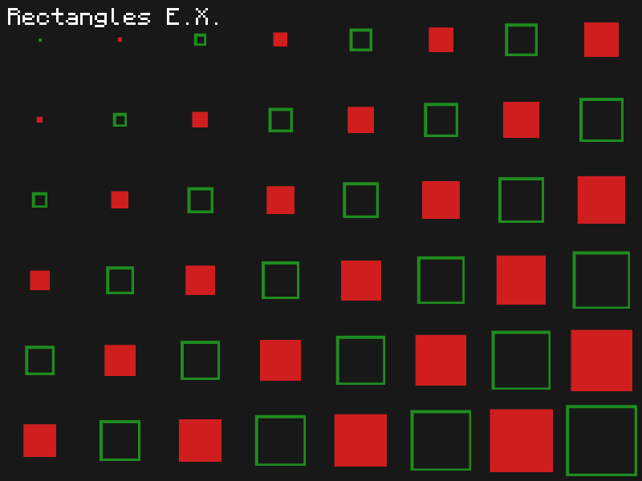
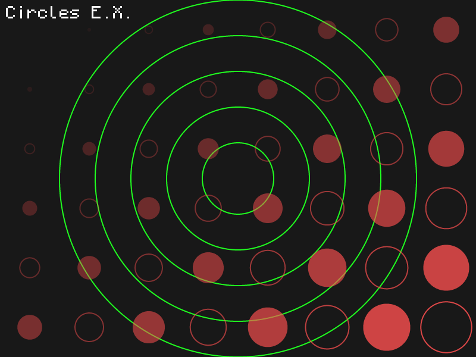
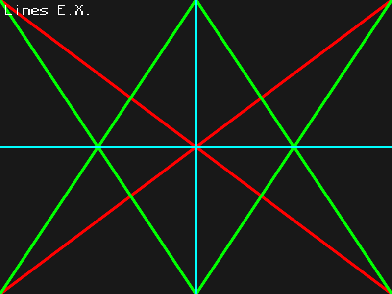
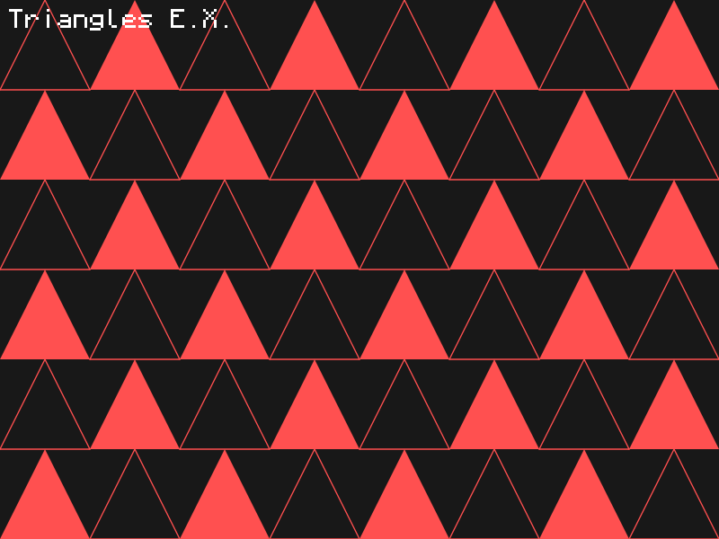
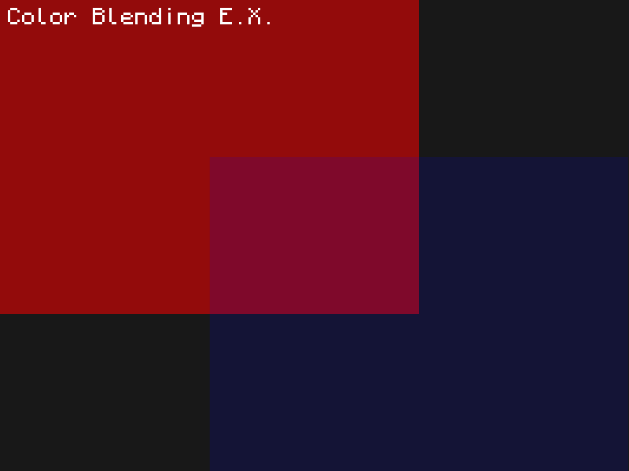
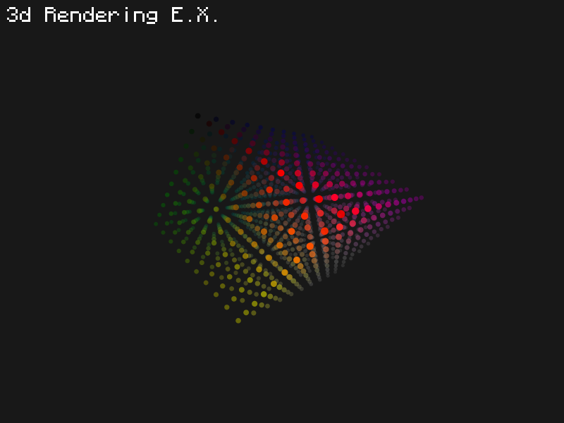

# NeoVin.c

A simple 2D Graphics Library for C

## Quick Start

```console
$ ./build.sh
$ ./example
```

## Gallery













## License
This project is licensed under the MIT License. See [LICENSE](LICENSE) for details.
